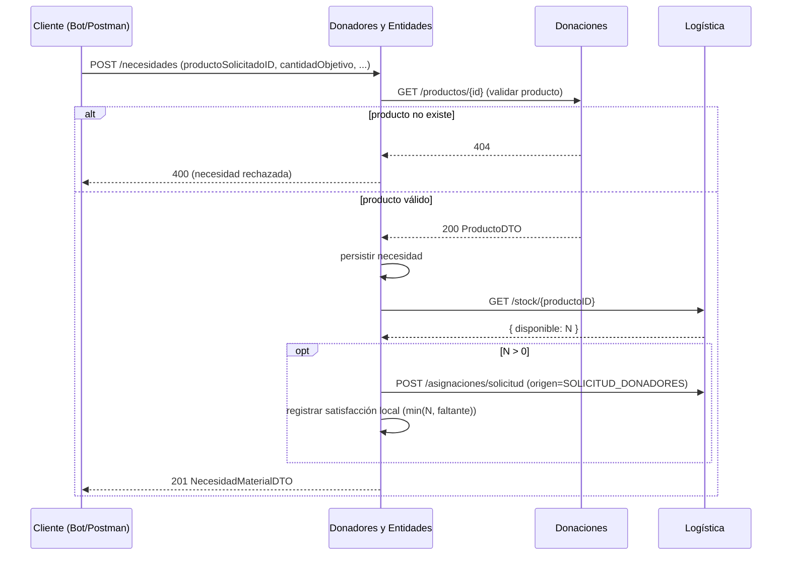

# Entrega 4 — Módulo Donadores y Entidades

Cambios implementados para la Entrega 4 en este módulo, y los contratos de integración con los
demás componentes.

## 1. Cambios implementados

| Cambio | Detalle |
|--------|---------|
| Validación de producto en `registrarNecesidad` | Al crear una necesidad se corrobora contra **Donaciones** (`GET /productos/{id}`) que el producto solicitado exista. Si no existe, se rechaza la necesidad. |
| Consulta de stock + auto-asignación | Tras crear la necesidad, se consulta a **Logística** el stock disponible del producto y, si hay, se solicita asignar `min(stock, faltante)` marcando el origen como `SOLICITUD_DONADORES` (para diferenciarlo del matchmaking, requerido por Incentivos). Best-effort. |
| Métrica nueva | `entidades.necesidades.errores` (necesidades rechazadas, p. ej. producto inexistente). |
| Logs de trazabilidad | Llamadas salientes a Donaciones y Logística logueadas en consola (Render). |

Notas de diseño:
- Las dependencias hacia Donaciones (`FachadaDonaciones`) y Logística (`LogisticaStockClient`) se
  inyectan con `@Autowired(required = false)` y están **guardadas por null**: con el constructor
  sin-args que usan los tests de cátedra, no se ejecutan, por lo que la suite de cátedra sigue 22/22.
- La parte de stock es **best-effort** (try/catch + log): si Logística no responde, la necesidad se
  crea igual. Esto desacopla la creación de necesidades de la disponibilidad de Logística.

## 2. Flujo: crear una necesidad (Entrega 4)

## 3. Contrato HTTP asumido que **Logística** debe exponer

La parte de "stock" es responsabilidad del módulo de Logística (su Entrega 4). Este módulo asume el
siguiente contrato (ajustable según lo que implemente Logística):

- **Consultar stock por producto**
  - `GET {logistica.url}/stock/{productoID}`
  - Respuesta: `{ "disponible": <entero> }`
- **Solicitar asignación originada en Donadores**
  - `POST {logistica.url}/asignaciones/solicitud`
  - Cuerpo: `{ "necesidadID", "productoID", "cantidad", "origen": "SOLICITUD_DONADORES" }`
  - Logística debe **persistir el `origen`** en la asignación para poder diferenciar las creadas por
    matchmaking de las solicitadas por Donadores (lo necesita Incentivos para nuevas misiones).

Configuración: `logistica.url` (env `LOGISTICA_URL`, default `http://localhost:8082`).

> Si Logística define endpoints distintos, solo hay que ajustar `LogisticaStockClient`; la lógica de
> `registrarNecesidad` queda igual.

## 4. Scope cross-módulo (responsabilidad de otros componentes)

- **Donaciones**: expone `GET /productos/{id}` devolviendo 404 si el producto no existe (ya
  implementado en su Entrega 4). Es lo que valida este módulo.
- **Logística**: stock por producto + asignación con `origen` + cola de trabajo / workers async.
- **Incentivos**: cron-job de procesamiento de donadores y pérdida de progreso de misiones.
- **Bot de Telegram (UI)**: app separada con operaciones de donador/entidad/necesidad. No forma
  parte de este repo (es un cliente HTTP de estas APIs).
