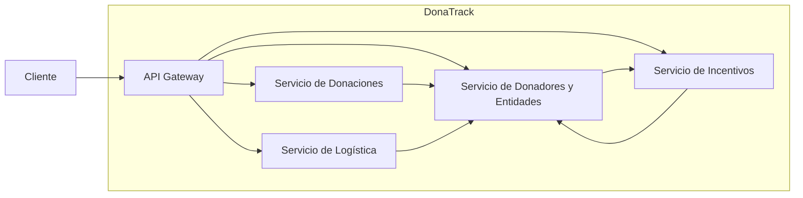

## Diagrama de arquitectura

```mermaid
flowchart LR

    Cliente[Cliente] --> APIGateway[API Gateway]

    subgraph Sistema["DonaTrack"]
        APIGateway --> Donadores[Servicio de Donadores y Entidades]
        APIGateway --> Donaciones[Servicio de Donaciones]
        APIGateway --> Incentivos[Servicio de Incentivos]
        APIGateway --> Logistica[Servicio de Logística]

        Donadores --> Incentivos
        Donaciones --> Donadores
        Logistica --> Donadores
        Incentivos --> Donadores
    end
```