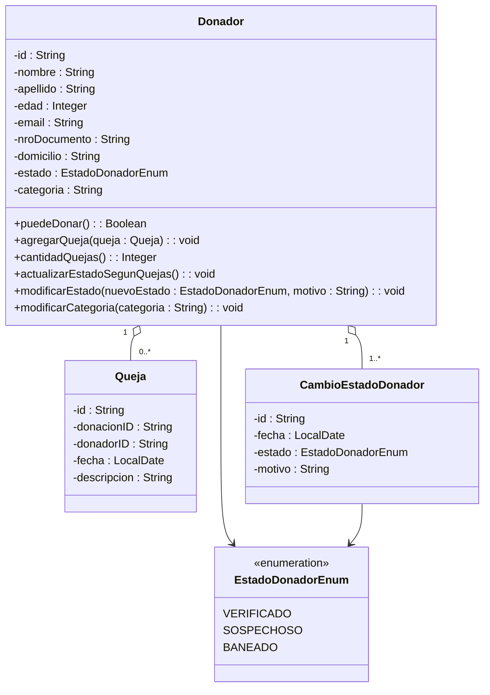
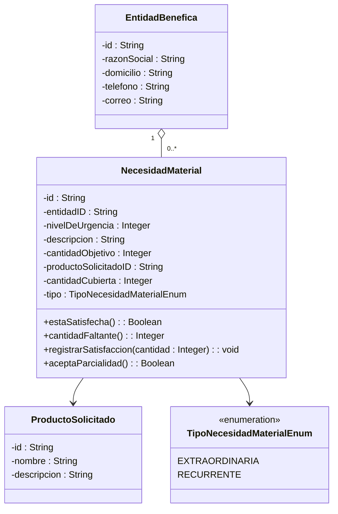

## Modelo de dominio - Donadores y Quejas

```mermaid
classDiagram
direction TB

class EstadoDonadorEnum {
    <<enumeration>>
    VERIFICADO
    SOSPECHOSO
    BANEADO
}

class Donador {
    -id : String
    -nombre : String
    -apellido : String
    -edad : Integer
    -email : String
    -nroDocumento : String
    -domicilio : String
    -estado : EstadoDonadorEnum
    -categoria : String
    +puedeDonar() : Boolean
    +agregarQueja(queja : Queja) : void
    +cantidadQuejas() : Integer
    +actualizarEstadoSegunQuejas() : void
    +modificarEstado(nuevoEstado : EstadoDonadorEnum, motivo : String) : void
    +modificarCategoria(categoria : String) : void
}

class Queja {
    -id : String
    -donacionID : String
    -donadorID : String
    -fecha : LocalDate
    -descripcion : String
}

class CambioEstadoDonador {
    -id : String
    -fecha : LocalDate
    -estado : EstadoDonadorEnum
    -motivo : String
}

Donador --> EstadoDonadorEnum
Donador "1" o-- "0..*" Queja
Donador "1" o-- "1..*" CambioEstadoDonador
CambioEstadoDonador --> EstadoDonadorEnum
```

## Modelo de dominio - Entidades Benéficas y Necesidades Materiales

```mermaid
classDiagram
direction TB

class EntidadBenefica {
    -id : String
    -razonSocial : String
    -domicilio : String
    -telefono : String
    -correo : String
}

class ProductoSolicitado {
    -id : String
    -nombre : String
    -descripcion : String
}

class TipoNecesidadMaterialEnum {
    <<enumeration>>
    EXTRAORDINARIA
    RECURRENTE
}

class NecesidadMaterial {
    -id : String
    -entidadID : String
    -nivelDeUrgencia : Integer
    -descripcion : String
    -cantidadObjetivo : Integer
    -productoSolicitadoID : String
    -cantidadCubierta : Integer
    -tipo : TipoNecesidadMaterialEnum
    +estaSatisfecha() : Boolean
    +cantidadFaltante() : Integer
    +registrarSatisfaccion(cantidad : Integer) : void
    +aceptaParcialidad() : Boolean
}

EntidadBenefica "1" o-- "0..*" NecesidadMaterial
NecesidadMaterial --> ProductoSolicitado
NecesidadMaterial --> TipoNecesidadMaterialEnum
```
